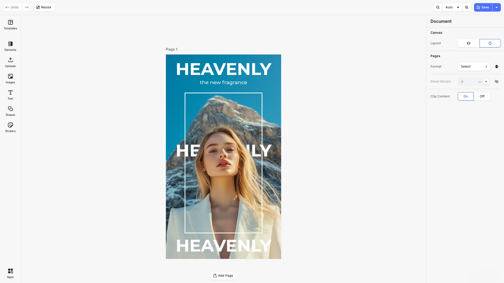

# Advanced Design Editor Starter Kit

Full-featured design editing for your web app with an advanced desktop-style interface — layers panel, precise controls, and professional export options. Built with [CE.SDK](https://img.ly/creative-sdk) by [IMG.LY](https://img.ly), runs entirely in the browser with no server dependencies.

<p>
  <a href="https://img.ly/docs/cesdk/starterkits/advanced-editor/">Documentation</a> |
  <a href="https://img.ly/showcases/cesdk">Live Demo</a>
</p>



## Getting Started

### Clone the Repository

```bash
git clone https://github.com/imgly/starterkit-advanced-design-editor-ts-web.git
cd starterkit-advanced-design-editor-ts-web
```

### Install Dependencies

```bash
npm install
```

### Download Assets

CE.SDK requires engine assets (fonts, icons, UI elements) served from your `public/` directory.

```bash
curl -O https://cdn.img.ly/packages/imgly/cesdk-js/$UBQ_VERSION$/imgly-assets.zip
unzip imgly-assets.zip -d public/
rm imgly-assets.zip
```

### Run the Development Server

```bash
npm run dev
```

Open `http://localhost:5173` in your browser.

## Configuration

### Loading Content

Load content into the editor using one of these methods:

```typescript
// Create a blank design canvas
await cesdk.createDesignScene();

// Load from a template archive
await cesdk.loadFromArchiveURL('https://example.com/template.zip');

// Load from a scene file
await cesdk.loadFromURL('https://example.com/scene.json');

// Load from an image
await cesdk.createFromImage('https://example.com/image.jpg');
```

See [Open the Editor](https://img.ly/docs/cesdk/web/guides/open-editor/) for all loading methods.

### Theming

```typescript
cesdk.ui.setTheme('dark'); // 'light' | 'dark' | 'system'
```

See [Theming](https://img.ly/docs/cesdk/web/ui-styling/theming/) for custom color schemes and styling.

### Localization

```typescript
cesdk.i18n.setTranslations({
  de: { 'common.save': 'Speichern' }
});
cesdk.i18n.setLocale('de');
```

See [Localization](https://img.ly/docs/cesdk/web/ui-styling/localization/) for supported languages and translation keys.

## Architecture

```
starterkit-advanced-design-editor-ts-web/
├── src/
│   ├── index.ts              # Application entry point
│   └── imgly/
│       ├── index.ts          # Editor initialization
│       ├── config/
│       │   ├── plugin.ts         # Main plugin orchestration
│       │   ├── actions.ts        # Load, Save, Export actions
│       │   ├── features.ts       # Feature toggles
│       │   ├── settings.ts       # Engine behavior
│       │   ├── i18n.ts           # Internationalization
│       │   └── ui/               # UI layout configuration
│       └── plugins/
│           └── background-removal.ts
├── public/                   # Static assets
├── package.json
└── vite.config.ts
```

## Key Capabilities

- **Layers Panel** – Manage element hierarchy and visibility
- **Precise Controls** – Exact positioning, sizing, and alignment
- **Text Editing** – Advanced typography and text effects
- **Image Editing** – Crop, filter, and adjust images
- **Multi-Page** – Create complex multi-page documents
- **Professional Export** – PNG, JPEG, PDF, and print-ready output

## Prerequisites

- **Node.js v20+** with npm – [Download](https://nodejs.org/)
- **Supported browsers** – Chrome 114+, Edge 114+, Firefox 115+, Safari 15.6+

## Troubleshooting

| Issue | Solution |
|-------|----------|
| Editor doesn't load | Verify assets are accessible at `baseURL` |
| Assets don't appear | Check `public/assets/` directory exists |
| Watermark appears | Add your license key |

## Documentation

For complete integration guides and API reference, visit the [Advanced Design Editor Documentation](https://img.ly/docs/cesdk/starterkits/advanced-editor/).

## License

This project is licensed under the MIT License - see the [LICENSE](LICENSE) file for details.

---

<p align="center">Built with <a href="https://img.ly/creative-sdk?utm_source=github&utm_medium=project&utm_campaign=starterkit-advanced-design-editor">CE.SDK</a> by <a href="https://img.ly?utm_source=github&utm_medium=project&utm_campaign=starterkit-advanced-design-editor">IMG.LY</a></p>
